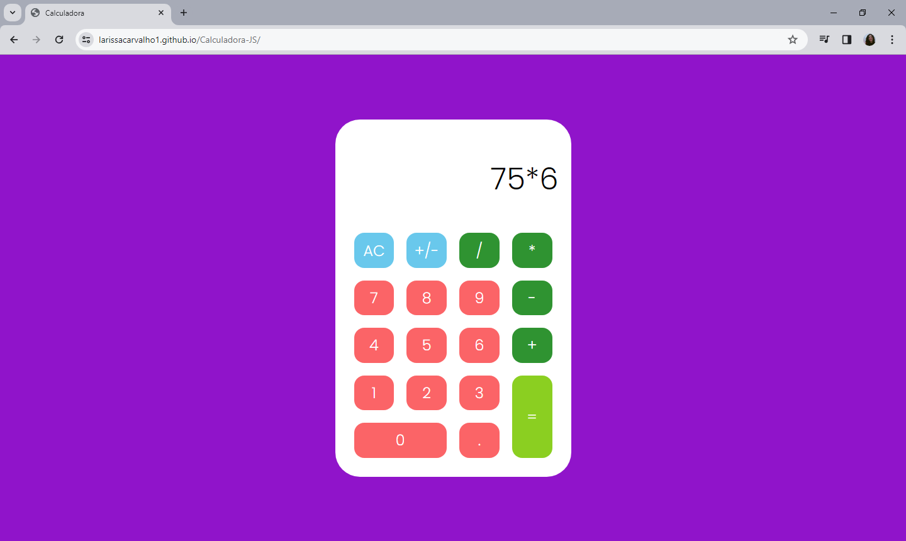

# 📐 Calculadora-JS 
Inspirada pelo tutorial do professor <a href="https://github.com/rodolfomori/">Rodolfo Mori</a>, desenvolvi esta calculadora simples, a fim de explorar e aprimorar o meu conhecimento a respeito de CSS Grid e JavaScript. 

## ⚙ Funcionalidades 
<ul>
    <li>Soma</li>
    <li>Subtração</li>
    <li>Multiplicação</li>
    <li>Divisão</li>
</ul>

## 👩‍💻 Tecnologias 
<ul>
    <li>HTML</li>
    <li>CSS</li>
    <li>JavaScript</li>
</ul>

Sinta-se à vontade para <a href="https://larissacarvalho1.github.io/Calculadora-JS/">acessar</a> e testar a calculadora. 🤍

